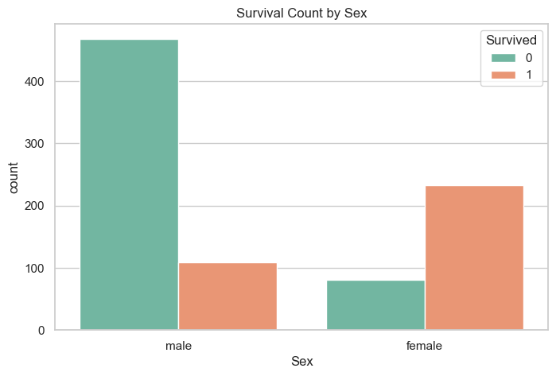
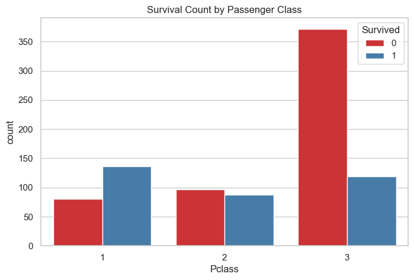
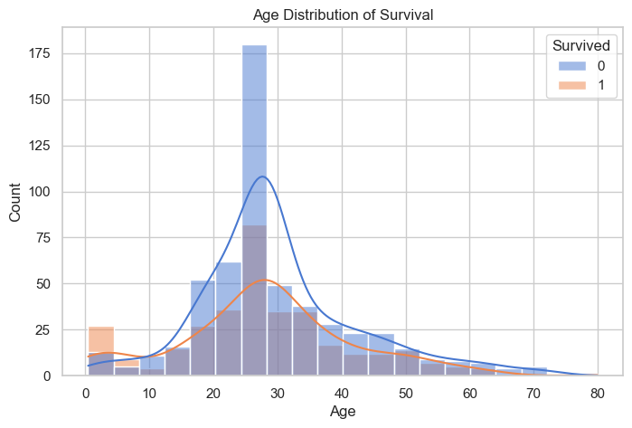
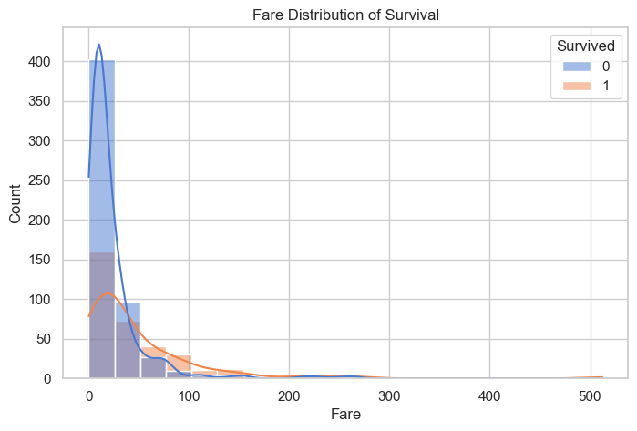
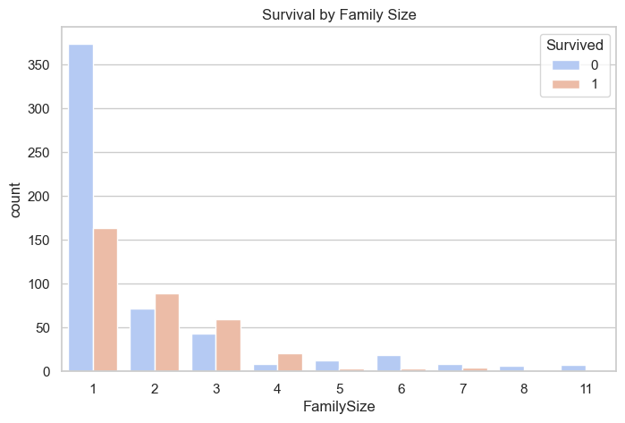
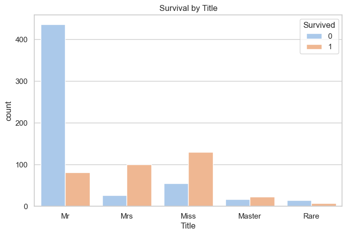
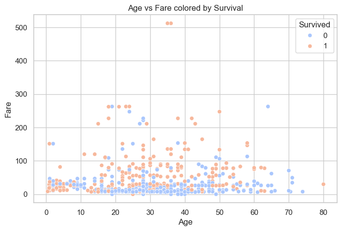

# Titanic Survival Classification

Predict whether a passenger survived the Titanic disaster using machine learning.

---

# Explore the Project

[Click here to open the EDA Notebook](notebooks/eda.ipynb)

---

## Project Overview

The goal of this project is to build a machine learning model that predicts Titanic passengers' survival based on features such as age, gender, ticket class, and fare.  

This project demonstrates:
- Data exploration and visualization
- Data preprocessing and feature engineering
- Model training, evaluation, and comparison
- Generating predictions for unseen data
- Reproducible Python environment setup

---

## Dataset

The dataset is from the [Kaggle Titanic Competition](https://www.kaggle.com/c/titanic).  

It includes:
- `train.csv`: Training data with known outcomes (Survived = 0 or 1)
- `test.csv`: Test data for submission (Survived unknown)
- Features like `Pclass`, `Sex`, `Age`, `SibSp`, `Parch`, `Fare`, `Embarked`, etc.

---

## Project Structure

my-first-ds-project/
├─ data/ # Raw & processed data (gitignored)
├─ notebooks/ # Exploratory notebooks
│ └─ eda.ipynb # EDA Notebook
├─ notebooks/plots/ # Plots generated from EDA
├─ src/ # Python scripts
│ ├─ init.py
│ ├─ preprocess.py
│ ├─ train.py
│ ├─ evaluate.py
│ └─ predict.py
├─ models/ # Saved models (.joblib)
├─ environment.yml # Conda environment for reproducibility
├─ README.md # Project documentation
└─ submission.csv # Kaggle submission file

yaml
Copy code

---

## Exploratory Data Analysis (EDA)

Visualizations help understand patterns in the data. Key plots:

**Survival Count by Sex**  


**Survival by Passenger Class**  


**Age Distribution of Survival**  


**Fare Distribution of Survival**  


**Survival by Family Size**  


**Survival by title**  


**Age vs fair coloured by survival**  


---

## Feature Engineering

- Extracted `Title` from `Name` (Mr, Mrs, Miss, Master, Rare)  
- Created `FamilySize` = SibSp + Parch + 1  
- Binned `Age` and `Fare` into discrete categories  
- Encoded categorical variables (`Sex`, `Embarked`, `Title`)  

---

## Model Training & Evaluation

Models used:  
- **Logistic Regression**  
- **Random Forest Classifier**  
- **Gradient Boosting Classifier**

Training steps:  
1. Load and preprocess data  
2. Split into training and validation sets (80/20)  
3. Train each model and evaluate using Accuracy & Classification Report  
4. Save the **best performing model** automatically in `models/`  

Example output:  
Random Forest Accuracy: 0.835
Classification Report:
precision recall f1-score support
0 0.84 0.88 0.86 105
1 0.82 0.76 0.79 74

yaml
Copy code

---

## Predictions

- Use `src/predict.py` to generate predictions for new passengers.
- Example usage:
```python
from src.predict import predict_new_passengers
import pandas as pd

new_data = pd.DataFrame([{
    "PassengerId": 1001,
    "Pclass": 1,
    "Name": "Alice Brown",
    "Sex": "female",
    "Age": 25,
    "SibSp": 0,
    "Parch": 0,
    "Ticket": "PC 17599",
    "Fare": 71.28,
    "Cabin": "C85",
    "Embarked": "C"
}])

preds = predict_new_passengers(new_data)
print(preds)
Predictions are also saved automatically to predictions.csv.

Reproducibility
Conda Environment

bash
Copy code
conda env create -f environment.yml
conda activate ds101
Run Training

bash
Copy code
python src/train.py
Generate Predictions

bash
Copy code
python src/predict.py
Results & Submission
Best model: Random Forest / Gradient Boosting (accuracy ~83–85%)

Submission file: submission.csv → upload to Kaggle Titanic Competition

Tools & Libraries
Python 3.x

pandas, numpy, scikit-learn

seaborn, matplotlib

joblib, Jupyter Notebook / VS Code

Conda for environment management

Notes
Clean, modular scripts under src/ for easy reuse

All plots saved in notebooks/plots/ for embedding or sharing

Environment exported for reproducibility

