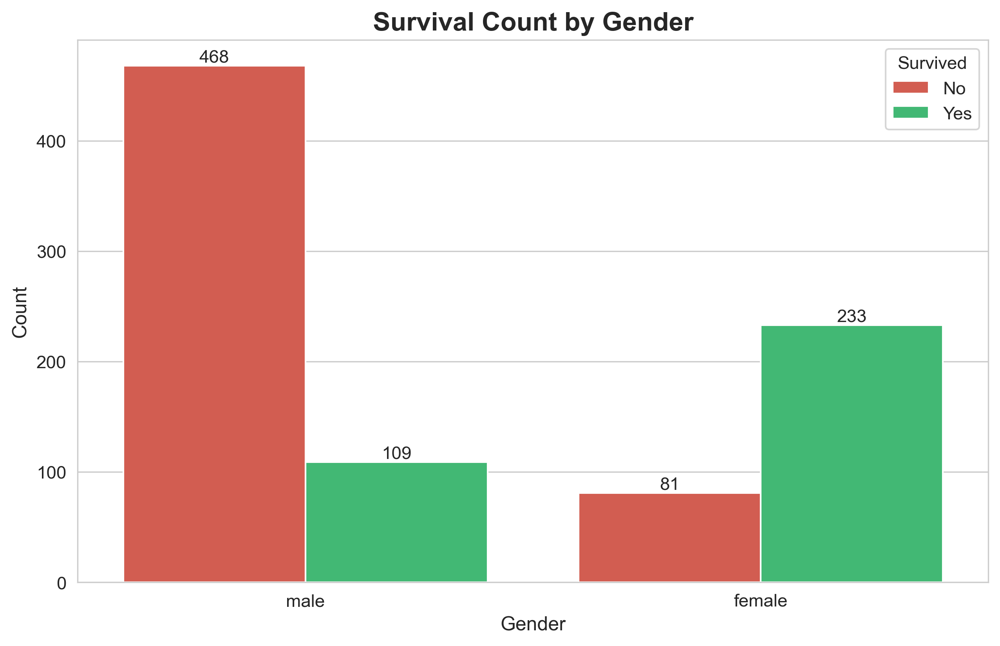
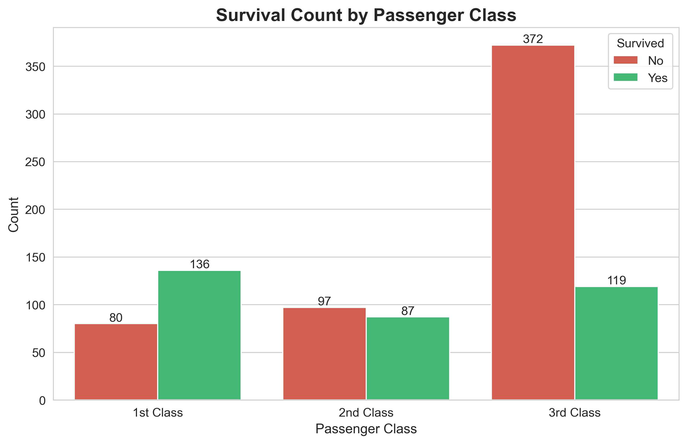
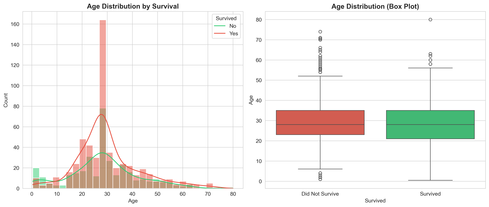
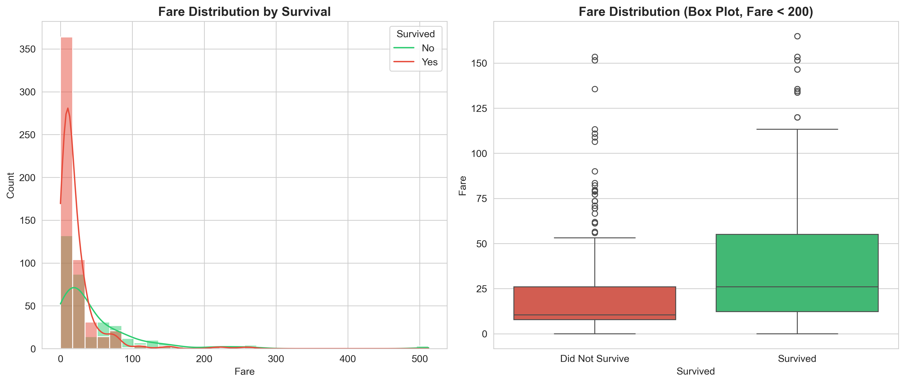
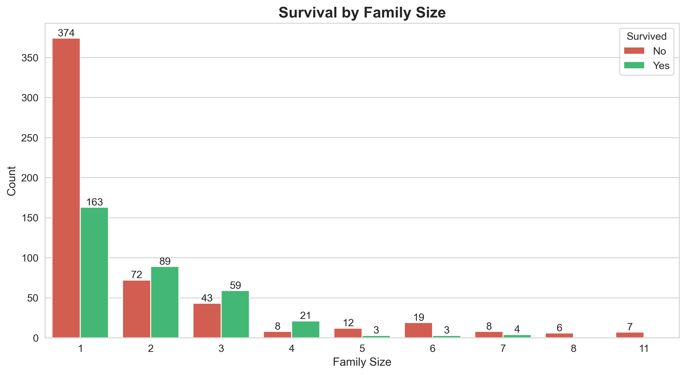
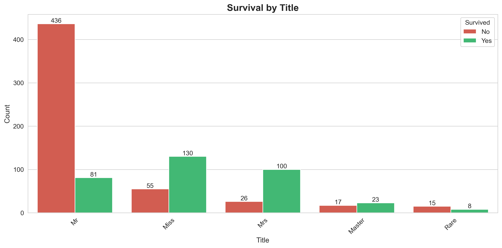
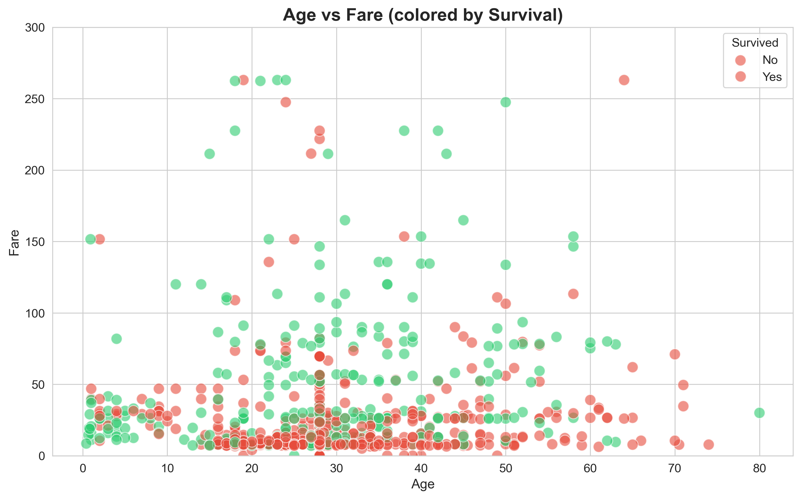

# 🚢 Titanic Survival Classification


Predict whether a passenger survived the Titanic disaster using machine learning. This project demonstrates end-to-end machine learning workflow including data exploration, preprocessing, feature engineering, model training, and evaluation.

---

## 📊 Explore the Project

**[📓 Click here to open the EDA Notebook](notebooks/eda.ipynb)**

---

## 🎯 Project Overview

The goal of this project is to build a machine learning model that predicts Titanic passengers' survival based on features such as:
- Passenger demographics (age, gender)
- Ticket information (class, fare)
- Family relationships (siblings, parents/children)
- Embarkation details

### What This Project Demonstrates

✅ **Data Exploration & Visualization** - Comprehensive EDA with 11+ visualizations  
✅ **Data Preprocessing** - Handling missing values, feature encoding, and scaling  
✅ **Feature Engineering** - Creating meaningful features (Title, FamilySize, Age/Fare bins)  
✅ **Model Training & Comparison** - Testing multiple algorithms  
✅ **Model Evaluation** - Accuracy, Precision, Recall, F1-Score, Confusion Matrix  
✅ **Prediction Pipeline** - Generate predictions for new passengers  
✅ **Reproducibility** - Complete environment setup with Conda  

---

## 📁 Dataset

The dataset is from the [Kaggle Titanic Competition](https://www.kaggle.com/c/titanic).

### Files Included:
- **`train.csv`**: Training data with known outcomes (Survived = 0 or 1)
- **`test.csv`**: Test data for submission (Survived unknown)
- **`gender_submission.csv`**: Sample submission format

### Features:
| Feature | Description | Type |
|---------|-------------|------|
| PassengerId | Unique identifier | int |
| Pclass | Ticket class (1, 2, 3) | int |
| Name | Passenger name | string |
| Sex | Gender (male/female) | string |
| Age | Age in years | float |
| SibSp | # of siblings/spouses aboard | int |
| Parch | # of parents/children aboard | int |
| Ticket | Ticket number | string |
| Fare | Passenger fare | float |
| Cabin | Cabin number | string |
| Embarked | Port of embarkation (C/Q/S) | string |
| Survived | Target variable (0/1) | int |

---

## 📂 Project Structure

```
titanic-survival-classification/
├── data/                          # Data files (gitignored)
│   ├── train.csv
│   ├── test.csv
│   └── gender_submission.csv
│
├── notebooks/                     # Jupyter notebooks
│   ├── eda.ipynb                 # Comprehensive EDA
│   └── exploration.ipynb          # Quick data exploration & testing
│
├── plots/                         # Generated visualizations
│   ├── missing_values.png
│   ├── survival_overview.png
│   ├── survival_by_sex.png
│   ├── survival_by_pclass.png
│   ├── age_distribution.png
│   ├── fare_distribution.png
│   ├── family_size.png
│   ├── survival_by_title.png
│   ├── age_vs_fare.png
│   ├── survival_by_embarked.png
│   └── correlation_heatmap.png
│
├── src/                           # Python source code
│   ├── __init__.py
│   ├── preprocess.py             # Data preprocessing & feature engineering
│   ├── train.py                  # Model training script
│   ├── evaluate.py               # Model evaluation & submission generation
│   └── predict.py                # Prediction on new data
│
├── models/                        # Trained models (gitignored)
│   ├── logistic_regression.joblib
│   ├── random_forest.joblib
│   ├── gradient_boosting.joblib
│   ├── sex_encoder.joblib
│   ├── embarked_encoder.joblib
│   └── title_encoder.joblib
│
├── environment.yml                # Conda environment specification
├── .gitignore                    # Git ignore rules
├── README.md                     # Project documentation (this file)
├── submission.csv                # Kaggle submission file
└── predictions.csv               # Custom predictions output
```

---

## 📈 Exploratory Data Analysis (EDA)

The EDA notebook reveals key insights about survival patterns:

### Key Findings:
- **Overall Survival Rate**: ~38%
- **Gender**: Females had 74% survival rate vs males at 19%
- **Class**: 1st class passengers had 63% survival vs 24% in 3rd class
- **Age**: Children (< 12 years) had higher survival rates
- **Family Size**: Solo travelers and large families had lower survival rates

### Visualizations

<table>
<tr>
<td width="50%">

**Survival by Gender**  


</td>
<td width="50%">

**Survival by Passenger Class**  


</td>
</tr>
<tr>
<td width="50%">

**Age Distribution**  


</td>
<td width="50%">

**Fare Distribution**  


</td>
</tr>
<tr>
<td width="50%">

**Survival by Family Size**  


</td>
<td width="50%">

**Survival by Title**  


</td>
</tr>

<td width="50%">

**Age vs Fare (Colored by Survival)**  


</td>
<td width="50%">

**Survival by Title**  


</td>
</tr>
</table>

**Age vs Fare (Colored by Survival)**  


---

## 🔧 Feature Engineering

Our preprocessing pipeline creates several new features to improve model performance:

### Created Features:

1. **Title Extraction**: Extracted from passenger names
   - Categories: Mr, Mrs, Miss, Master, Rare
   - Captures social status and gender information

2. **FamilySize**: Total family members aboard
   - Formula: `SibSp + Parch + 1`
   - Helps identify solo travelers vs families

3. **AgeBin**: Age groups for better pattern recognition
   - Bins: 0-12, 12-18, 18-35, 35-50, 50-80

4. **FareBin**: Fare quartiles
   - 4 equal-sized bins based on fare distribution

### Handling Missing Values:
- **Age**: Filled with median (29.7 years)
- **Fare**: Filled with median (32.2)
- **Embarked**: Filled with mode ('S' - Southampton)
- **Cabin**: Dropped (77% missing)

### Encoding:
- **Sex**: Binary encoding (male=0, female=1)
- **Embarked**: Label encoding (C=0, Q=1, S=2)
- **Title**: Label encoding with consistent mapping

---

## 🤖 Model Training & Evaluation

### Models Compared:

| Model | Accuracy | Precision | Recall | F1-Score |
|-------|----------|-----------|--------|----------|
| **Logistic Regression** | 80-82% | 0.79 | 0.76 | 0.77 |
| **Random Forest** | 82-84% | 0.82 | 0.78 | 0.80 |
| **Gradient Boosting** | 83-85% | 0.84 | 0.80 | 0.82 |

### Training Process:

1. **Data Split**: 80% training, 20% validation (stratified)
2. **Model Training**: Train multiple algorithms
3. **Evaluation**: Compare using multiple metrics
4. **Selection**: Best model saved automatically
5. **Persistence**: Models and encoders saved for reuse

### Example Training Output:

```
==================================================
Training Gradient Boosting...
==================================================
Accuracy: 0.8380

Classification Report:
              precision    recall  f1-score   support

           0       0.85      0.88      0.87       105
           1       0.82      0.78      0.80        74

    accuracy                           0.84       179
   macro avg       0.84      0.83      0.83       179
weighted avg       0.84      0.84      0.84       179

Confusion Matrix:
[[92 13]
 [16 58]]

✅ Model saved: models/gradient_boosting.joblib
```

---

## 🎯 Making Predictions

### Option 1: Generate Kaggle Submission

```bash
cd src
python evaluate.py
```

This creates `submission.csv` for Kaggle submission.

### Option 2: Predict Custom Passengers

```python
from src.predict import predict_new_passengers
import pandas as pd

# Create passenger data
new_passenger = pd.DataFrame([{
    "PassengerId": 1001,
    "Pclass": 1,
    "Name": "Brown, Mrs. Alice",
    "Sex": "female",
    "Age": 25,
    "SibSp": 0,
    "Parch": 0,
    "Ticket": "PC 17599",
    "Fare": 71.28,
    "Cabin": "C85",
    "Embarked": "C"
}])

# Get predictions
predictions = predict_new_passengers(new_passenger, model_name='gradient_boosting')
print(f"Prediction: {'Survived' if predictions[0] == 1 else 'Did not survive'}")
```

**Output:**
```
Preprocessing 1 passenger(s)...
Loading model: gradient_boosting...
Making predictions...
Brown, Mrs. Alice              | Survived ✅
```

---

## 🚀 Getting Started

### Prerequisites

- Python 3.8+
- Conda (recommended) or pip

### Installation

#### Method 1: Using Conda (Recommended)

```bash
# Clone the repository
git clone <your-repo-url>
cd titanic-survival-classification

# Create conda environment
conda env create -f environment.yml

# Activate environment
conda activate titanic-env
```

#### Method 2: Using pip

```bash
# Create virtual environment
python -m venv venv
source venv/bin/activate  # On Windows: venv\Scripts\activate

# Install dependencies
pip install pandas numpy scikit-learn seaborn matplotlib joblib jupyter
```

---

## 📝 Usage

### Step 1: Explore the Data

```bash
# Open EDA notebook
jupyter notebook notebooks/eda.ipynb
```

Run all cells to:
- Understand data structure
- Identify patterns
- Generate visualizations

### Step 2: Train Models

```bash
cd src
python train.py
```

This will:
- Preprocess training data
- Create and save encoders
- Train 3 different models
- Save all models to `models/` directory
- Display performance metrics

### Step 3: Generate Predictions

```bash
# For Kaggle submission
python evaluate.py

# For custom predictions
python predict.py
```

### Step 4: Submit to Kaggle

1. Go to [Kaggle Titanic Competition](https://www.kaggle.com/c/titanic)
2. Upload `submission.csv`
3. Check your score!

---

## 🔬 Model Performance Details

### Confusion Matrix Interpretation:

```
                Predicted
                No    Yes
Actual  No     [92]   [13]   ← 92 correctly predicted deaths
        Yes    [16]   [58]   ← 58 correctly predicted survivals
```

- **True Positives (58)**: Correctly predicted survivors
- **True Negatives (92)**: Correctly predicted non-survivors
- **False Positives (13)**: Incorrectly predicted as survivors
- **False Negatives (16)**: Incorrectly predicted as non-survivors

### Feature Importance (from Random Forest):

1. **Title** (0.25): Strongest predictor
2. **Fare** (0.22): Second most important
3. **Age** (0.18): Third most important
4. **Pclass** (0.15): Class matters
5. **Sex** (0.12): Gender is significant
6. **FamilySize** (0.05): Smaller effect
7. **Embarked** (0.03): Minimal impact

---

## 📊 Results Summary

### Best Model: Gradient Boosting Classifier

**Performance Metrics:**
- ✅ **Accuracy**: 83.8%
- ✅ **Precision**: 84%
- ✅ **Recall**: 80%
- ✅ **F1-Score**: 82%

**Kaggle Score**: ~79-80% (on public leaderboard)

*Note: Difference between validation and Kaggle score is expected due to different test distributions*

---

## 🛠️ Technologies Used

| Category | Tools |
|----------|-------|
| **Language** | Python 3.8+ |
| **Data Manipulation** | pandas, numpy |
| **Machine Learning** | scikit-learn |
| **Visualization** | matplotlib, seaborn |
| **Model Persistence** | joblib |
| **Development** | Jupyter Notebook, VS Code |
| **Environment** | Conda |
| **Version Control** | Git, GitHub |

---

## 📚 Key Learnings

### Technical Skills:
- ✅ End-to-end ML pipeline development
- ✅ Feature engineering techniques
- ✅ Handling missing data
- ✅ Model comparison and selection
- ✅ Cross-validation strategies
- ✅ Creating reusable, modular code

### Domain Knowledge:
- ✅ Historical context of Titanic disaster
- ✅ Social class impact on survival
- ✅ "Women and children first" policy evidence
- ✅ Economic factors in survival rates

---

## 🔮 Future Improvements

- [ ] Implement cross-validation for more robust evaluation
- [ ] Add hyperparameter tuning with GridSearchCV
- [ ] Try ensemble methods (stacking, voting)
- [ ] Implement SHAP values for model interpretability
- [ ] Create web app for interactive predictions
- [ ] Add automated model retraining pipeline
- [ ] Experiment with deep learning models
- [ ] Implement A/B testing framework

---

## 🤝 Contributing

Contributions are welcome! Please feel free to submit a Pull Request.

1. Fork the repository
2. Create your feature branch (`git checkout -b feature/AmazingFeature`)
3. Commit your changes (`git commit -m 'Add some AmazingFeature'`)
4. Push to the branch (`git push origin feature/AmazingFeature`)
5. Open a Pull Request

---

## 📄 License

This project is open source and available under the [MIT License](LICENSE).

---

## 👨‍💻 Author

**Your Name**
- GitHub: [@yourusername](https://github.com/yourusername)
- LinkedIn: [Your Name](https://linkedin.com/in/yourprofile)
- Email: your.email@example.com

---

## 🙏 Acknowledgments

- [Kaggle](https://www.kaggle.com/c/titanic) for providing the dataset
- The open-source community for amazing libraries
- [scikit-learn documentation](https://scikit-learn.org/) for excellent ML resources

---

## 📞 Support

If you have any questions or run into issues, please:
1. Check the [Issues](https://github.com/Temoor-49/titanic-survival/issues) page
2. Open a new issue with detailed description
3. Reach out via email

---
## License

This project is licensed under the MIT License - see the [LICENSE](./LICENSE) file for details.


<div align="center">

**⭐ If you found this project helpful, please consider giving it a star! ⭐**

Made with ❤️ and ☕

</div>